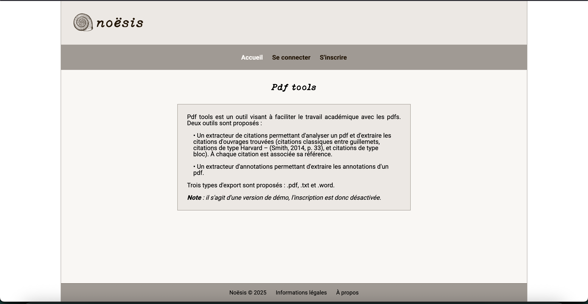

# PdfToolsFront

This frontend is a demo interface for interacting with the backend of the Noësis PDF Extractor Tools.
It allows users to upload PDF files and export citations or annotations in various formats (PDF, DOCX, TXT).

This frontend is part of the broader initiative, which aims to create tools for researchers and students.

The backend — which handles extraction logic and file generation — is available [here](https://github.com/CamilleNerriere/pdf-extractor-tools)

## Preview

You can fin the demo [here](https://noesis-pdf-tools.vercel.app/)




## Main Features

* Upload a PDF file
* Choose between citation or annotation extraction
* Select export format (PDF, DOCX, or TXT)
* Download the resulting ZIP file
* Basic login with JWT authentication

## Tech Stack

* Angular 20/ TypeScript
* Custom CSS (no framework)
* HttpClient (for backend communication)

## Getting started

`````
npm install
npm start
``````

Make sure to set the backend URL in environment.development.ts/environment.ts : 

```javascript
export const environment = {
  production: false,
  apiUrl: 'http://localhost:8080'
};
```

## Turn off the registration limitation 

If you want to test the app locally with your own account, you can disable the demo mode by modifying the AuthController in the backend code:

```java
private final boolean IS_DEMO = true;
````

Or you can try the demo public version [here](https://noesis-pdf-tools.vercel.app/) and send me a message at camille.nerriere@proton.me. I’ll be happy to provide you with the demo access code!

